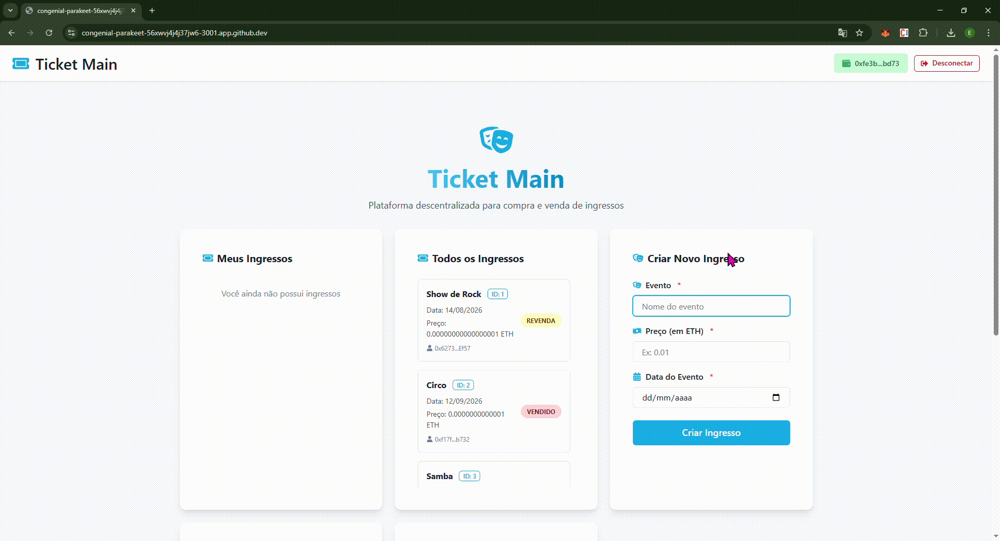

# TicketMain: Sistema Descentralizado de Venda e Revenda de Ingressos

<div align="center">

[](https://soliditylang.org/)
[](https://nodejs.org/)

</div>

**TicketMain** é uma aplicação descentralizada (DApp) que permite a criação, compra, venda e revenda de ingressos digitais baseados em NFTs, utilizando blockchain privada com Hyperledger Besu e mecanismo de consenso IBFT2.

## 🚀 Demonstração

<div align="center">
  
</div>

## ✨ Destaques

<div align="center">

### Telas da Aplicação
<div style="display: flex; justify-content: space-around; align-items: center; flex-wrap: wrap;">


</div>


</div>

## 🎯 Funcionalidades

| Funcionalidade | Descrição | Status |
|---|---|---|
| **Criação de ingressos** | Organizadores podem emitir ingressos digitais para eventos | ✅ Concluído |
| **Compra de ingressos** | Usuários podem adquirir ingressos disponíveis | ✅ Concluído |
| **Revenda de ingressos** | Proprietários podem revender seus ingressos no mercado secundário | ✅ Concluído |
| **Visualização de ingressos** | Listagem de ingressos próprios e todos os ingressos | ✅ Concluído |
| **Rastreabilidade completa** | Todas as transações são registradas na blockchain | ✅ Concluído |
| **Segurança garantida** | Utilização de padrões ERC-721 e práticas de segurança em smart contracts | ✅ Concluído |

## 🛠️ Tecnologias Utilizadas

<div align="center">

### Arquitetura em Camadas


</div>

### Backend
- **Hyperledger Besu**: Cliente Ethereum para rede blockchain permissionada
- **IBFT2**: Mecanismo de consenso com finalidade imediata
- **Solidity**: Linguagem para desenvolvimento de smart contracts

### Smart Contract
- **OpenZeppelin**: Bibliotecas de segurança para contratos inteligentes
- **ERC-721**: Padrão de tokens não fungíveis
- **HardHat**: Ambiente de desenvolvimento para contratos

### Frontend
- **Next.js**: Framework React para aplicações web
- **TypeScript**: Tipagem estática
- **Chakra UI**: Biblioteca de componentes acessíveis
- **ethers.js**: Biblioteca para interação com blockchain Ethereum
- **Framer Motion**: Biblioteca para animações

## 📋 Pré-requisitos

- [Docker](https://www.docker.com/get-started) (v20+)
- [Docker Compose](https://docs.docker.com/compose/)
- [Node.js](https://nodejs.org/) (v18+)
- [Git](https://git-scm.com/) (v2.0+)
- [MetaMask](https://metamask.io/) (extensão do navegador)

## 🚀 Instalação e Execução

### 1. Clone o repositório

```bash
git clone https://github.com/erickaguiar10/TCC2
cd TCC2
```

### 2. Inicialize a rede blockchain

```bash
cd quorum-test-network
./run.sh
```

> ⏱️ A inicialização pode levar alguns minutos. Aguarde até que todos os serviços estejam rodando.

### 3. Execute o deploy do contrato inteligente

```bash
cd dapps/quorumToken
npm install
npx hardhat run scripts/deploy_quorumtoken.ts --network quickstart
```

> 📝 Anote o endereço do contrato implantado para configurar o frontend.

### 4. Inicie o frontend

```bash
cd frontend
npm install
npm run dev
```

### 5. Acesse a aplicação

- **Frontend**: [http://localhost:3001](http://localhost:3001)
- **Chainlens (explorador de blocos)**: [http://localhost:25000](http://localhost:25000)

## 🔧 Configuração do MetaMask

1. Abra a extensão MetaMask no seu navegador
2. Clique em "Redes" → "Adicionar Rede Personalizada"
3. Preencha as informações:
   - **Nome da rede**: `TicketMain Network`
   - **RPC URL**: `http://localhost:8545`
   - **Chain ID**: `1337`
   - **Moeda**: `ETH`
4. Importe uma das contas fornecidas pelo Quorum Developer Quickstart:
   - Conta 1: `0x8f2a55949038a9610f50fb23b5883af3b4ecb3c3bb792cbcefbd1542c692be63`
   - Conta 2: `0xc87509a1c067bbde78beb793e6fa76530b6382a4c0241e5e4a9ec0a0f44dc0d3`
   - Conta 3: `0xae6ae8e5ccbfb04590405997ee2d52d2b330726137b875053c36d94e974d162f`

## 📖 Como Usar

### Como Organizador

1. Conecte sua carteira MetaMask
2. Verifique se você é o proprietário do contrato (endereço que fez o deploy)
3. Use o formulário "Criar Novo Ingresso"
4. Preencha os dados: nome do evento, preço e data
5. Confirme a transação no MetaMask

### Como Comprador

1. Conecte sua carteira MetaMask
2. Navegue até "Comprar Ingresso"
3. Consulte os ingressos disponíveis
4. Selecione um ingresso e insira o Token ID
5. Confirme a compra com o valor necessário no MetaMask

### Revenda de Ingressos

1. Acesse "Revender Ingresso"
2. Insira o Token ID do ingresso que deseja revender
3. Defina o novo preço
4. Confirme a transação no MetaMask
5. O ingresso agora aparece como disponível para compra

## 🏗️ Arquitetura

O sistema é organizado em quatro camadas principais:

<div align="center">

```
┌─────────────────┐
│   Frontend      │ ← React/Next.js + Chakra UI
├─────────────────┤
│  Integração     │ ← ethers.js + MetaMask
├─────────────────┤
│ Smart Contract  │ ← Solidity + ERC-721
├─────────────────┤
│  Blockchain     │ ← Hyperledger Besu + IBFT2
└─────────────────┘
```

</div>

## 📊 Diagramas e Fluxos

<div align="center">

### Fluxos de Negócio
<div style="display: flex; justify-content: space-around; align-items: center; flex-wrap: wrap;">

[](https://res.cloudinary.com/dzkmdtthg/image/upload/v1764210159/fluxo_compra_z2x4w3.png)

[](https://res.cloudinary.com/dzkmdtthg/image/upload/v1764210159/fluxo_revenda_acgbps.png)

[](https://res.cloudinary.com/dzkmdtthg/image/upload/v1764210159/fluxo_criacao_ytcdaa.png)


</div>

</div>

## 🧪 Testes

Para executar os testes do smart contract:

```bash
cd dapps/quorumToken
npx hardhat test
```

## 🛡️ Segurança

- **Validação de dados**: Cada transação é validada antes da execução
- **Padrão CEI**: Implementação do padrão Checks-Effects-Interactions
- **Ownable**: Funções restritas apenas ao proprietário do contrato
- **Timestamp validation**: Verificação de datas futuras para eventos
- **Controle de acesso**: Permissões adequadas para diferentes operações

## 📈 Benefícios

- **Eliminação de intermediários**: Transações diretas entre compradores e vendedores
- **Rastreabilidade total**: Histórico completo de todas as transações
- **Autenticidade garantida**: Cada ingresso é único e impossível de falsificar
- **Transparência**: Todos os dados estão registrados na blockchain
- **Eficiência**: Processamento rápido de transações com IBFT2

## 🤝 Contribuições

Contribuições são bem-vindas! Sinta-se à vontade para:

1. Fazer fork do projeto
2. Criar uma branch com sua feature (`git checkout -b feature/NovaFeature`)
3. Commit suas alterações (`git commit -m 'Adiciona nova feature'`)
4. Push para a branch (`git push origin feature/NovaFeature`)
5. Abrir um Pull Request

<p align="center">
  Made with ❤️ for the future of decentralized ticketing
</p>
